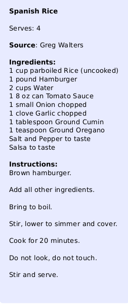

# recipe_app
A simple menu-driven recipe database program written in python3

<aside>
    <ul>
        <li>Store recipes for later retrival.</li>
        <li>Search by:</li>
            <dd>Recipe title</dd>
            <dd>Author</dd>
            <dd>Ingredients</dd>
        <li>Create new recipe entries</li>
        <li>Delete recipes</li>
        <li>Print Out recipes</li>
    </ul>
</aside>

DATA
====

The Recipes are stored in the [Database](recipe_app.db)

Usage
=====
Run:
<pre>
$ <kbd>python3 recipe_app.py</kbd>
</pre>

Dependencies
============
Requires:
    1. Database Engine

    SQLite3 - A small database engine that does not require separate database server

OnLinuxRun:
<pre>
$ <kbd>sudo apt-get install sqlite3</kbd>
</pre>

    2. python3 modules 
    apsw - Another python SQLite wrapper. A quick way to communicate with SQLite
					
OnLinuxRun:
<pre>
$ <kbd>sudo pip3 install apsw</kbd>
</pre>

Attribution
===========
Originally Written By:
Greg Walters - RainyDay Solutions, LLC

Full circle magazine Issue #33 - Program In Python part 7-9
[full circle magazine](www.fullcirclemagazine.org)

License - Creative Commons Attribution-Share Alike 3.0 Unported license
==========================================================================
More on the licence, 

 This work is licensed under a <a rel="license" href="http://creativecommons.org/licenses/by-sa/3.0/">Creative Commons Attribution-ShareAlike 3.0 Unported License</a>.

